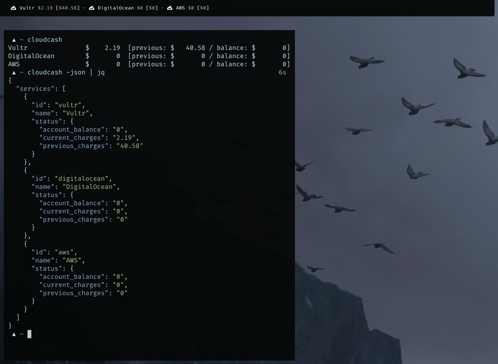

Cloudcash
---------

Monitor your cloud spendings from the CLI (and from
[Waybar](https://github.com/Alexays/Waybar))!



**Supported Cloud Services:**

- [x] Vultr
- [x] DigitalOcean
- [ ] Render
- [ ] Heroku
- [ ] Amazon Web Services
- [ ] Google Cloud Platform
- [ ] [suggest a new
  one!](https://github.com/mrusme/cloudcash/issues/new?title=[suggestion]%20New%20cloud%20service%20NAME%20HERE)


## Build

```sh
go build .
```

## Configuration

```sh
cat ~/.config/cloudcash.toml
```

```
WaybarPango = "  {{.Service}} <span color='#aaaaaa'>${{.CurrentCharges}}</span>"

[Service]

[Service.Vultr]
APIKey = "XXXXXX"
```


## Use

### CLI

```sh
cloudcash
```

### Waybar

```sh
rg -NA6 'cloudcash":'  ~/.config/waybar/config
```

```json
  "custom/cloudcash": {
    "format": "{}",
    "return-type": "json",
    "exec": "/usr/local/bin/cloudcash -waybar-pango",
    "on-click": "",
    "interval": 3600
  },
```

