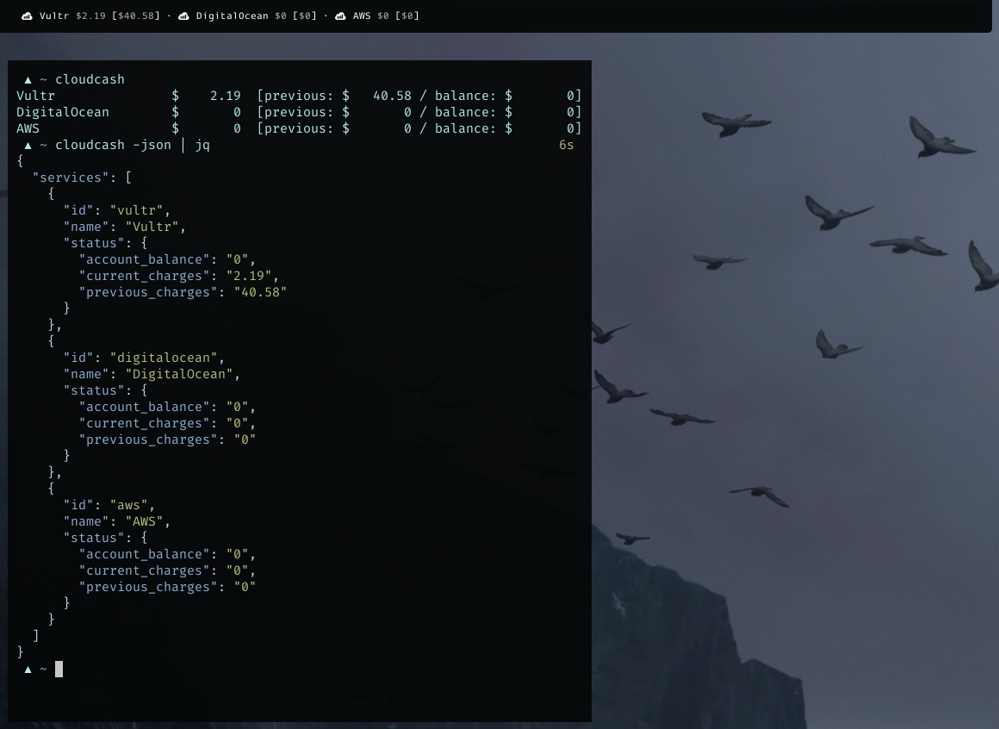
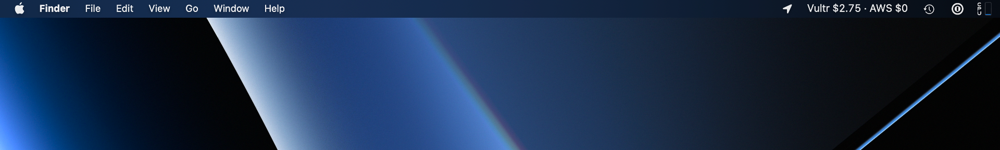

Cloudcash
---------

[](https://xn--gckvb8fzb.com/support/) [](https://matrix.to/#/%21PHlbgZTdrhjkCJrfVY%3Amatrix.org)

Check your cloud spending from the CLI, from
[Waybar](https://github.com/Alexays/Waybar), and from the macOS menu bar!


#### Waybar



#### macOS menu bar



#### Supported cloud services

- [ ] [Alibaba
  Cloud](https://www.alibabacloud.com/help/en/bss-openapi/latest/querybill) *(have no account ¯\\_(ツ)_/¯  )*
- [x] Amazon Web Services
- [x] DigitalOcean
- [x] GitHub
- [ ] [Google Cloud Platform](https://cloud.google.com/go/billing/apiv1) *(have
  no account ¯\\_(ツ)_/¯  )*
- [ ]
  [Heroku](https://devcenter.heroku.com/articles/platform-api-reference#team-monthly-usage)
  *(have no account ¯\\_(ツ)_/¯  )*
- [ ] Hetzner Cloud *(no billing API yet)*
- [ ] [Microsoft
  Azure](https://docs.microsoft.com/en-us/azure/cost-management-billing/manage/consumption-api-overview)
  *(have no account ¯\\_(ツ)_/¯  )*
- [ ] [Oracle
  Cloud](https://docs.oracle.com/en-us/iaas/Content/Billing/Concepts/costanalysisoverview.htm) *(have no account ¯\\_(ツ)_/¯  )*
- [ ] Render *(no billing API yet)*
- [x] Vultr
- [ ] [suggest a new
  one!](https://github.com/mrusme/cloudcash/issues/new?title=[suggestion]%20New%20cloud%20service%20NAME%20HERE)


## Build

```sh
go build .
```


## Configuration

Only add the services that you want to use and delete all the others:

```sh
cat ~/.config/cloudcash.toml
```

```
[Waybar]
Pango = "  {{.Name}} <span color='#aaaaaa'>${{.Status.CurrentCharges}}</span> [<span color='#aaaaaa'>${{.Status.PreviousCharges}}</span>]"
PangoJoiner = " · "

[Menu]
Template = "{{.Name}} ${{.Status.CurrentCharges}}"
Joiner = " · "
IsDefault = false

[Service]

[Service.Vultr]
APIKey = "XXXX"

[Service.DigitalOcean]
APIKey = "XXXX"

[Service.AWS]
AWSAccessKeyID = "AAAA"
AWSSecretAccessKey = "XXXX"
Region = "us-east-1"

[Service.GitHub]
APIKey = "XXXX"
Users = [
  "mrusme"
]
Orgs = [ 
  "paper-street-soap-co"
]
```

Alternative paths for configuration file:

- `/etc/cloudcash.toml`
- `$XDG_CONFIG_HOME/cloudcash.toml`
- `$HOME/.config/cloudcash.toml`
- `$HOME/cloudcash.toml`
- `./cloudcash.toml`

***Note regarding GitHub:*** You can specify multiple users/orgs, which are
queried and added up to one total amount. Calculation is done locally, based on
the paid minutes reported by the GitHub API and the [officially available
numbers](https://docs.github.com/en/billing/managing-billing-for-github-actions/about-billing-for-github-actions),
and could be off to a certain degree, due to additional costs that might have
incurred on GitHub.


### Waybar

The `Pango` template used in the `-waybar-pango` output is used **per service**,
separated by the `PangoJouner` string. To make it clear, if `Pango` is
`<span>{{.Name}}</span>` and `PangoJoiner` is ` - ` then the output for two
services (e.g. Vultr and AWS) would be:

```html
<span>Vultr</span> - <span>AWS</span>
```

The `Pango` configuration uses Go's
[`text/template`](https://pkg.go.dev/text/template).


### macOS menu bar 

The `Template` in `Menu` is what is used to render the macOS menu bar widget. As
with the [Waybar](#waybar) output, the template is **per service**, separated by
the `Joiner` string. Unlike the `Waybar.Pango` configuration, `Menu.Template`
does not support Pango, but it can include things like Emojis.

To always run in menu mode, set `Menu.IsDefault` to `true`.


## Use


### CLI (text)

```sh
cloudcash
```


### CLI (JSON)

```sh
cloudcash -json
```


### Waybar

```sh
rg -NA6 'cloudcash":'  ~/.config/waybar/config
```

```json
  "custom/cloudcash": {
    "format": "{}",
    "return-type": "json",
    "exec": "/usr/local/bin/cloudcash -waybar-pango",
    "on-click": "",
    "interval": 3600
  },
```


### macOS menu bar 

```sh
cloudcash -menu-mode 
```

Alternatively set `Menu.IsDefault` to `true` in configuration.
