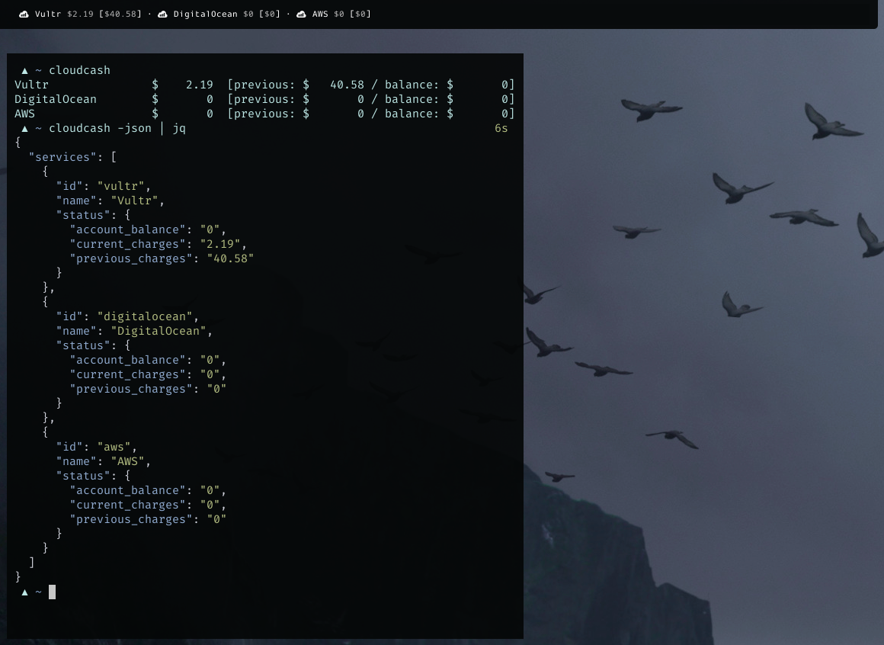

## Cloudcash

[](https://xn--gckvb8fzb.com/contact/)

Check your cloud spending from the CLI, from
[Waybar](https://github.com/Alexays/Waybar), and from the macOS menu bar!

#### Waybar



#### macOS menu bar


#### Supported cloud services

- [ ] [Alibaba Cloud](https://www.alibabacloud.com/help/en/bss-openapi/latest/querybill)
      _(have no account ¯\\_(ツ)_/¯ )_
- [x] Amazon Web Services
- [x] Claude _(subscription usage, see note below)_
- [x] DigitalOcean
- [x] GitHub
- [ ] [Google Cloud Platform](https://cloud.google.com/go/billing/apiv1) _(have
      no account ¯\\_(ツ)_/¯ )_
- [ ]
  [Heroku](https://devcenter.heroku.com/articles/platform-api-reference#team-monthly-usage)
  _(have no account ¯\\_(ツ)_/¯ )_
- [ ] Hetzner Cloud _(no billing API yet)_
- [ ] [Microsoft Azure](https://docs.microsoft.com/en-us/azure/cost-management-billing/manage/consumption-api-overview)
      _(have no account ¯\\_(ツ)_/¯ )_
- [ ] [Oracle Cloud](https://docs.oracle.com/en-us/iaas/Content/Billing/Concepts/costanalysisoverview.htm)
      _(have no account ¯\\_(ツ)_/¯ )_
- [ ] Render _(no billing API yet)_
- [x] Vultr
- [ ] [suggest a new one!](https://github.com/mrusme/cloudcash/issues/new?title=[suggestion]%20New%20cloud%20service%20NAME%20HERE)

## Build

```sh
go build .
```

## Configuration

Only add the services that you want to use and delete all the others:

```sh
cat ~/.config/cloudcash.toml
```

```
[Waybar]
Pango = "  {{.Name}} <span color='#aaaaaa'>${{.Status.CurrentCharges}}</span> [<span color='#aaaaaa'>${{.Status.PreviousCharges}}</span>]"
PangoJoiner = " · "

[Menu]
Template = "{{.Name}} ${{.Status.CurrentCharges}}"
Joiner = " · "
IsDefault = false

[Service]

[Service.Vultr]
APIKey = "XXXX"

[Service.DigitalOcean]
APIKey = "XXXX"

[Service.AWS]
AWSAccessKeyID = "AAAA"
AWSSecretAccessKey = "XXXX"
Region = "us-east-1"

[Service.GitHub]
APIKey = "XXXX"
Users = [
  "mrusme"
]
Orgs = [ 
  "paper-street-soap-co"
]

[Service.Claude]
Enabled = true
```

Alternative paths for configuration file:

- `/etc/cloudcash.toml`
- `$XDG_CONFIG_HOME/cloudcash.toml`
- `$HOME/.config/cloudcash.toml`
- `$HOME/cloudcash.toml`
- `./cloudcash.toml`

_**Note regarding GitHub:**_ You can specify multiple users/orgs, which are
queried and added up to one total amount. Calculation is done locally, based on
the paid minutes reported by the GitHub API and the
[officially available numbers](https://docs.github.com/en/billing/managing-billing-for-github-actions/about-billing-for-github-actions),
and could be off to a certain degree, due to additional costs that might have
incurred on GitHub.

_**Note regarding Claude:**_ This reports your _Claude subscription_ (Pro/Max)
usage, not Claude API billing. Alongside the usage credits spent so far, it
exposes two extra fields that no other service provides:
`{{.Status.SessionUsage}}` (current 5-hour session) and
`{{.Status.WeeklyUsage}}` (current 7-day window), both as percentages of your
plan's quota.

By default the OAuth token is read from `~/.claude/.credentials.json`, which the
[Claude Code](https://code.claude.com) CLI maintains and refreshes. Override the
location with `CredentialsFile`, or pass a token directly with `OAuthToken`:

```
[Service.Claude]
Enabled = true
# CredentialsFile = "/home/you/.claude/.credentials.json"
# OAuthToken = "XXXX"
```

Be aware that Anthropic offers no documented API for subscription usage. This
uses the same undocumented endpoint that Claude Code's own `/usage` command
queries, so it may break without notice. Anthropic's _documented_ usage and cost
APIs cover API organizations only, require an Admin API key, and are not
available to individual accounts.

### Waybar

The `Pango` template used in the `-waybar-pango` output is used **per service**,
separated by the `PangoJouner` string. To make it clear, if `Pango` is
`<span>{{.Name}}</span>` and `PangoJoiner` is `-` then the output for two
services (e.g. Vultr and AWS) would be:

```html
<span>Vultr</span> - <span>AWS</span>
```

The `Pango` configuration uses Go's
[`text/template`](https://pkg.go.dev/text/template).

`PangoUsage` is a second template, appended to `Pango`, that renders **only for
services reporting quota usage**, currently [Claude](#configuration). `Pango`
applies to every service, so putting `{{.Status.SessionUsage}}` in it would show
`0%` next to Vultr, AWS and everyone else. It defaults to:

```
PangoUsage = " [<span color='#aaaaaa'>{{.Status.SessionUsage}}%</span> · <span color='#aaaaaa'>{{.Status.WeeklyUsage}}%</span>]"
```

Set it to `""` to leave the percentages out of the Waybar output.

### macOS menu bar

The `Template` in `Menu` is what is used to render the macOS menu bar widget. As
with the [Waybar](#waybar) output, the template is **per service**, separated by
the `Joiner` string. Unlike the `Waybar.Pango` configuration, `Menu.Template`
does not support Pango, but it can include things like Emojis.

To always run in menu mode, set `Menu.IsDefault` to `true`.

## Use

### CLI (text)

```sh
cloudcash
```

### CLI (JSON)

```sh
cloudcash -json
```

### Waybar

```sh
rg -NA6 'cloudcash":'  ~/.config/waybar/config
```

```json
"custom/cloudcash": {
  "format": "{}",
  "return-type": "json",
  "exec": "/usr/local/bin/cloudcash -waybar-pango",
  "on-click": "",
  "interval": 3600
},
```

### macOS menu bar

```sh
cloudcash -menu-mode
```

Alternatively set `Menu.IsDefault` to `true` in configuration.
