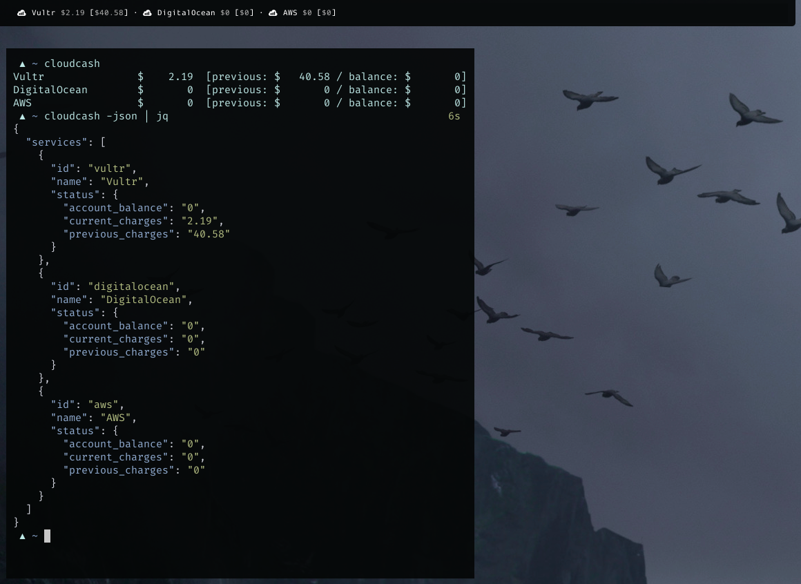

## Cloudcash

[](https://xn--gckvb8fzb.com/segv/)

[](https://xn--gckvb8fzb.com/contact/)

Check your cloud spending from the CLI, from
[Waybar](https://github.com/Alexays/Waybar), and from the macOS menu bar!

#### Waybar



#### macOS menu bar


#### Supported cloud services

- [ ] [Alibaba Cloud](https://www.alibabacloud.com/help/en/bss-openapi/latest/querybill)
      _(have no account ¯\\_(ツ)_/¯ )_
- [x] Amazon Web Services
- [x] Claude _(subscription usage, see note below)_
- [x] Codex _(subscription usage, see note below)_
- [x] DigitalOcean
- [x] GitHub
- [ ] [Google Cloud Platform](https://cloud.google.com/go/billing/apiv1) _(have
      no account ¯\\_(ツ)_/¯ )_
- [ ]
  [Heroku](https://devcenter.heroku.com/articles/platform-api-reference#team-monthly-usage)
  _(have no account ¯\\_(ツ)_/¯ )_
- [x] Hetzner Cloud _(calculated locally, see note below)_
- [ ] [Microsoft Azure](https://docs.microsoft.com/en-us/azure/cost-management-billing/manage/consumption-api-overview)
      _(have no account ¯\\_(ツ)_/¯ )_
- [ ] [Oracle Cloud](https://docs.oracle.com/en-us/iaas/Content/Billing/Concepts/costanalysisoverview.htm)
      _(have no account ¯\\_(ツ)_/¯ )_
- [ ] Render _(no billing API yet)_
- [x] Vultr
- [ ] [suggest a new one!](https://github.com/mrusme/cloudcash/issues/new?title=[suggestion]%20New%20cloud%20service%20NAME%20HERE)

## Build

```sh
go build .
```

## Configuration

Only add the services that you want to use and delete all the others:

```sh
cat ~/.config/cloudcash.toml
```

```
[Waybar]
Pango = "  {{.Name}} <span color='#aaaaaa'>{{.Status.CurrentCharges}} {{.Status.Currency}}</span> [<span color='#aaaaaa'>{{.Status.PreviousCharges}} {{.Status.Currency}}</span>]"
PangoJoiner = " · "

[Menu]
Template = "{{.Name}} {{.Status.CurrentCharges}} {{.Status.Currency}}"
Joiner = " · "
IsDefault = false

[Service]

[Service.Vultr]
APIKey = "XXXX"

[Service.DigitalOcean]
APIKey = "XXXX"

[Service.AWS]
AWSAccessKeyID = "AAAA"
AWSSecretAccessKey = "XXXX"
Region = "us-east-1"

[Service.GitHub]
APIKey = "XXXX"
Users = [
  "mrusme"
]
Orgs = [ 
  "paper-street-soap-co"
]

[Service.Claude]
Enabled = true

[Service.Codex]
Enabled = true

[Service.Hetzner]
APIKey = "XXXX"
```

Alternative paths for configuration file:

- `/etc/cloudcash.toml`
- `$XDG_CONFIG_HOME/cloudcash.toml`
- `$HOME/.config/cloudcash.toml`
- `$HOME/cloudcash.toml`
- `./cloudcash.toml`

Every option can also be set through an environment variable, e.g.
`CLOUDCASH_SERVICE_VULTR_APIKEY`.

Secrets don't have to be stored in the file. `APIKeyCommand`,
`AWSSecretAccessKeyCommand` and `OAuthTokenCommand` run a command through
`sh -c` (`cmd` on Windows) and use the first line of its output. The plain
option takes precedence when both are set:

```
[Service.Vultr]
APIKeyCommand = "pass show vultr"
```

_**Note regarding AWS:**_ `CurrentCharges` and `PreviousCharges` cover the
current and the previous month, rounded to two decimals. Each refresh makes one
Cost Explorer request, which AWS bills at $0.01.

_**Note regarding GitHub:**_ You can specify multiple users/orgs, which are
queried and added up to one total amount. The amount is the `netAmount` of the
current month's [billing usage report][gh-usage], covering all metered products.
A fine-grained token needs the _Plan_ user permission (read) for `Users` and the
_Administration_ organization permission (read) for `Orgs`.

[gh-usage]: https://docs.github.com/en/rest/billing/usage

_**Note regarding Claude:**_ This reports your _Claude subscription_ (Pro/Max)
usage, not Claude API billing. `CurrentCharges` shows the usage credits spent so
far, in the currency of your extra usage. It also exposes
`{{.Status.SessionUsage}}` (current 5-hour session) and
`{{.Status.WeeklyUsage}}` (current 7-day window), both as percentages of your
plan's quota, and `{{.Status.SessionResetsIn}}` and
`{{.Status.WeeklyResetsIn}}`, the seconds until each window resets.

By default the OAuth token is read from `~/.claude/.credentials.json`, which the
[Claude Code](https://code.claude.com) CLI maintains and refreshes. Override the
location with `CredentialsFile`, or pass a token directly with `OAuthToken`:

```
[Service.Claude]
Enabled = true
# CredentialsFile = "/home/you/.claude/.credentials.json"
# OAuthToken = "XXXX"
# UsageOnly = true
```

On a fixed plan without usage-based billing, set `UsageOnly = true` to show only
the percentages. It applies to the text output and the default `Pango` template,
and a custom `Pango` can check `{{if not .UsageOnly}}` to do the same.

Be aware that Anthropic offers no documented API for subscription usage. This
uses the same undocumented endpoint that Claude Code's own `/usage` command
queries, so it may break without notice. Anthropic's _documented_ usage and cost
APIs cover API organizations only, require an Admin API key, and are not
available to individual accounts.

_**Note regarding Codex:**_ This reports your _ChatGPT subscription_ usage, not
OpenAI API billing, and works the same way the Claude provider does. It fills
`{{.Status.SessionUsage}}` and `{{.Status.SessionResetsIn}}` from the 5-hour
window and `{{.Status.WeeklyUsage}}` and `{{.Status.WeeklyResetsIn}}` from the
weekly one. OpenAI reports credits _remaining_ rather than credits spent, so the
figure ends up in `{{.Status.AccountBalance}}` and `CurrentCharges` stays at
zero. Accounts on an unlimited plan report no balance.

The OAuth token and account ID are read from `$CODEX_HOME/auth.json`, falling
back to `~/.codex/auth.json`, which the
[Codex](https://developers.openai.com/codex) CLI maintains and refreshes:

```
[Service.Codex]
Enabled = true
# CredentialsFile = "/home/you/.codex/auth.json"
# OAuthToken = "XXXX"
# AccountID = "XXXX"
# UsageOnly = true
```

The same caveat as with Claude applies, only more so: OpenAI publishes no API
for subscription usage, and this queries the endpoint the Codex CLI polls for
its `/status` output. Newer Codex versions can keep credentials in the system
keyring instead of `auth.json`, in which case there is no token to read and you
have to set `OAuthToken` yourself. OpenAI's _documented_ costs and usage APIs
cover platform spending only and need an admin key.

_**Note regarding Hetzner:**_ Hetzner Cloud has no billing endpoint, so charges
are calculated locally. The
[hcloud-go](https://github.com/hetznercloud/hcloud-go) library supplies both the
price list and the resources on the account. Each resource is billed from the
later of the first of the month or its own creation date, at the hourly rate,
and never beyond the monthly price, which is how Hetzner itself caps it.

Servers, load balancers, volumes, primary IPs and floating IPs are counted,
including backup surcharges and outgoing traffic past what a server or load
balancer includes. Prices are net. Set `Gross = true` for VAT-inclusive ones:

```
[Service.Hetzner]
APIKey = "XXXX"
# Gross = true
```

This is an estimate rather than an invoice, because only resources that still
exist are visible through the API, so anything deleted earlier in the month is
missing from the total, and snapshots, images and additional features are not
counted at all.

### Waybar

The `Pango` template used in the `-waybar-pango` output is used **per service**,
separated by the `PangoJoiner` string. To make it clear, if `Pango` is
`<span>{{.Name}}</span>` and `PangoJoiner` is `-` then the output for two
services (e.g. Vultr and AWS) would be:

```html
<span>Vultr</span> - <span>AWS</span>
```

The `Pango` configuration uses Go's
[`text/template`](https://pkg.go.dev/text/template). `{{.Status.Currency}}`
contains the ISO 4217 code of the amounts, such as `USD` or `EUR`, and
`.UsageOnly` is true for services with `UsageOnly` set. The `duration` function
formats a countdown, e.g. `{{duration .Status.SessionResetsIn}}` renders as
`2h13m`. `Pango` defaults to:

```
Pango = "{{.Name}}{{if not .UsageOnly}} {{.Status.CurrentCharges}} {{.Status.Currency}}{{end}}"
```

`PangoUsage` is a second template, appended to `Pango`, that renders **only for
services reporting quota usage**, currently Claude and Codex. `Pango` applies to
every service, so putting `{{.Status.SessionUsage}}` in it would show `0%` next
to Vultr, AWS and everyone else. It defaults to:

```
PangoUsage = " [<span color='#aaaaaa'>{{.Status.SessionUsage}}%</span> · <span color='#aaaaaa'>{{.Status.WeeklyUsage}}%</span>]"
```

Set it to `""` to leave the percentages out of the Waybar output.

### macOS menu bar

The `Template` in `Menu` is what is used to render the macOS menu bar widget. As
with the [Waybar](#waybar) output, the template is **per service**, separated by
the `Joiner` string. Unlike the `Waybar.Pango` configuration, `Menu.Template`
does not support Pango, but it can include things like Emojis. It defaults to
`{{.Name}} {{.Status.CurrentCharges}} {{.Status.Currency}}`.

To always run in menu mode, set `Menu.IsDefault` to `true`.

## Use

### CLI (text)

```sh
cloudcash
```

### CLI (JSON)

```sh
cloudcash -json
```

Claude and Codex statuses also contain `session_resets_at` and
`weekly_resets_at`, and the seconds left in `session_resets_in` and
`weekly_resets_in`.

### Waybar

```sh
rg -NA6 'cloudcash":'  ~/.config/waybar/config
```

```json
"custom/cloudcash": {
  "format": "{}",
  "return-type": "json",
  "exec": "/usr/local/bin/cloudcash -waybar-pango",
  "on-click": "",
  "interval": 3600
},
```

### macOS menu bar

```sh
cloudcash -menu-mode
```

Alternatively set `Menu.IsDefault` to `true` in configuration.

### Errors

Errors are printed to stderr, with text and JSON output exiting with 1 when a
service fails. `-waybar-pango` leaves failed services out and exits with 0,
because Waybar hides a module when its command fails. Configuration and template
errors exit with 1 in every mode, as does `-menu-mode` outside macOS.

### Cache

The last successful result of each service is stored in `cloudcash/status.json`
under `$XDG_CACHE_HOME` or `~/.cache`. On macOS the directory is
`~/Library/Caches`. When a service is rate limited, meaning HTTP 429 or AWS
throttling, its cached value is shown and a notice is printed to stderr.
Deleting the file is safe.
